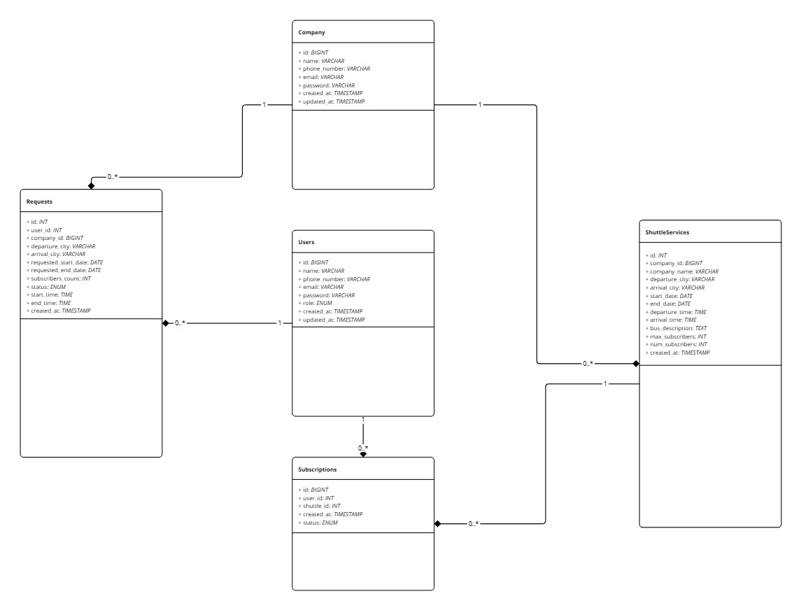

# Projet ViaGo JEE

## Description

Une plateforme de service de navette par abonnement reliant les entreprises de transport aux utilisateurs.

## Caractéristiques

### Pour les entreprises de transport

- Créer et gérer des services de navette entre les villes <a href="5"/>
- Voir et gérer les demandes d'abonnement des utilisateurs<a href="13"/>
- Accepter ou rejeter les demandes<a href="15"/>
- Suivre la progression des abonnements et l'occupation<a href="19"/>

### Pour les utilisateurs

- Parcourez les services de navette disponibles<a href="25"/>
- S'abonner aux services de navette<a href="30"/>
- Voir l'état de l'abonnement<a href="35"/>
- Demander de nouveaux itinéraires de navette<a href="39"/>

## Critères d'acceptation

### Les entreprises de transport peuvent :

- Définir les villes de départ et d'arrivée<a href="8"/>
- Définir les périodes d'abonnement<a href="9"/>
- Spécifiez les horaires de départ/arrivée<a href="10"/>
- Décrire les commodités et la capacité des bus<a href="11"/>
- Gérer les limites d'abonnés<a href="12"/>

### Les utilisateurs peuvent :

- Rechercher par villes de départ/d'arrivée<a href="28"/>
- Voir les détails du service et la disponibilité<a href="29"/>
- Inscrivez-vous/connectez-vous pour accéder aux fonctionnalités d'abonnement<a href="33"/>
- Suivre l'état de la demande<a href="48"/>

## Base de données

### Les entreprise :

CREATE TABLE company (
id BIGINT UNSIGNED AUTO_INCREMENT PRIMARY KEY,
name VARCHAR(255),
phone_number VARCHAR(50),
email VARCHAR(255),
created_at TIMESTAMP DEFAULT CURRENT_TIMESTAMP,
updated_at TIMESTAMP DEFAULT CURRENT_TIMESTAMP ON UPDATE CURRENT_TIMESTAMP,
password VARCHAR(255)
);

### Nouveaux itinéraires de navette:

CREATE TABLE requests (
id INT AUTO_INCREMENT PRIMARY KEY,
user_id INT,
company_id BIGINT UNSIGNED,
departure_city VARCHAR(255),
arrival_city VARCHAR(255),
requested_start_date DATE,
requested_end_date DATE,
subscribers_count INT DEFAULT 0,
created_at TIMESTAMP DEFAULT CURRENT_TIMESTAMP,
status ENUM('pending', 'ok', 'cancel'),
start_time TIME,
end_time TIME,
CONSTRAINT fk_user
FOREIGN KEY (user_id)
REFERENCES users(id)
ON DELETE CASCADE,
CONSTRAINT fk_company
FOREIGN KEY (company_id)
REFERENCES company(id)
ON DELETE CASCADE
);

### Services de navette:

CREATE TABLE shuttleservices (
id INT UNSIGNED AUTO_INCREMENT PRIMARY KEY,
company_id BIGINT UNSIGNED,
company_name VARCHAR(255),
departure_city VARCHAR(255),
arrival_city VARCHAR(255),
start_date DATE,
end_date DATE,
departure_time TIME,
arrival_time TIME,
bus_description TEXT,
max_subscribers INT,
created_at TIMESTAMP DEFAULT CURRENT_TIMESTAMP,
num_subscribers INT,
CONSTRAINT fk_company
FOREIGN KEY (company_id)
REFERENCES company(id)
ON DELETE CASCADE
);

### Des abonnements:

CREATE TABLE subscriptions (
id BIGINT UNSIGNED AUTO_INCREMENT PRIMARY KEY,
user_id INT NOT NULL,
shuttle_id INT UNSIGNED NOT NULL,
created_at TIMESTAMP DEFAULT CURRENT_TIMESTAMP,
status ENUM('subscribed', 'canceled') DEFAULT 'canceled',
FOREIGN KEY (user_id) REFERENCES users(id) ON DELETE CASCADE,
FOREIGN KEY (shuttle_id) REFERENCES shuttleservices(id) ON DELETE CASCADE
);

### Utilisateurs:

CREATE TABLE users (
id BIGINT UNSIGNED AUTO_INCREMENT PRIMARY KEY,
name VARCHAR(255),
phone_number VARCHAR(50),
email VARCHAR(255),
role ENUM('company', 'user') DEFAULT 'user',
created_at TIMESTAMP DEFAULT CURRENT_TIMESTAMP,
updated_at TIMESTAMP DEFAULT CURRENT_TIMESTAMP ON UPDATE CURRENT_TIMESTAMP,
password VARCHAR(255)
);

